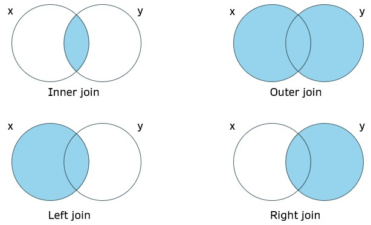
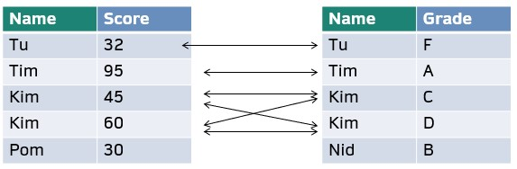
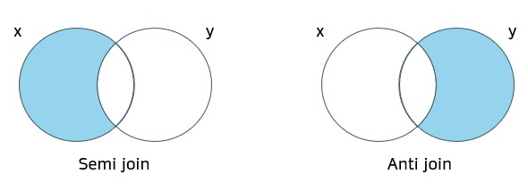
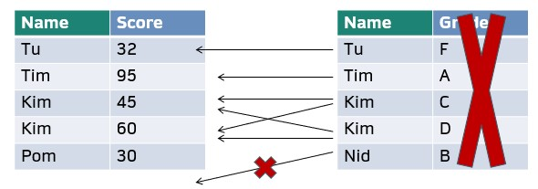

# **Data wrangling**

## Data manipulation with `dplyr`

`dplyr` คือ package ย่อยของ `tidyverse` ซึ่งทำหน้าที่จัดการ dataframe ที่ท่านนำเข้าไปใน R ให้เป็นในรูปแบบที่ท่านต้องการ

```{r dplyr, message = FALSE}
library(dplyr) 
```

### Basic dataframe manipulation

ในกรณีนี้จะใช้ข้อมูลตัวอย่าง `iris` เพื่อสาธิตการใช้ `dplyr` โดย `iris` เป็นข้อมูลของความยาวกลีบของพันธุ์ดอกไม้ต่างๆ

```{r iris, fig.align="center", echo = FALSE}
knitr::include_graphics("Picture/iris.png")
```

รูปจาก: <https://www.datacamp.com/tutorial/machine-learning-in-r>

```{r load_iris}
df <- iris # โหลด dataframe ตัวอย่างที่ติดมากับ base R
head(df, 5)
```

function หลักๆ ของ `dplyr` จะเกี่ยวข้องกับ data manipulation เป็นส่วนใหญ่ ในที่นี้จะแนะนำที่จำเป็นต้องใช้ในบทอื่น

-   `glimpse()` มีไว้ดูภาพรวมข้อมูล

```{r glimpse}
glimpse(df)
```

-   `select()` เลือก column ที่ต้องการโดยใช้ตำแหน่งหรือชื่อ column ก็ได้

```{r select}
df |> select(Species) |> head(5) # เลือก column "Species"
df |> select(2) |> head(5) # เลือก column ที่ 2
df |> select(1:2) |> head(5) # เลือก 2 column
df |> select(contains("Length")) |> head(5) # เลือก column ที่มีคำว่า "Length"
```

-   `filter()` กรองแถว (row) ที่ต้องการ โดยต้องระบุ ว่าต้องการข้อมูล ที่ column ไหน และต้องการกรองค่าที่เท่าไร

```{r filter}
# เลือกแถวที่ Species == virginica
df |>  filter(Species == "virginica") |>  head(5)

# เลือกแถวที่ Species = setosa, Sepal.Length = 5.4
df |>  
  filter(Species == "setosa" & Sepal.Length == 5.4) |>  head(5)

# เลือกแถวที่ Sepal.Length = 5.1 หรือ 4.9
df |>  filter(Sepal.Length == 5.1 | Sepal.Length == 4.9) |>  head(10)
```

สังเกตว่าจะเห็นเครื่องหมาย `|>` ซึ่งใน R ท่านจะเรียกว่า "pipe operator" เป็นสิ่งที่เป็นเอกลักษณ์ใน R ซึ่งส่งผลให้สามารถ run operation ได้ต่อๆ กัน เพื่อให้อ่านได้ง่าย

```{r pipe_operation}
# เลือกแถวที่ Species = setosa คอลัมน์ Sepal.Length
df |> 
  filter(Species == "setosa") |> 
  select(Sepal.Length) |> head(5)

# เหมือนกับข้างบน แต่ไม่ใช้ pipe operator จะทำความเข้าใจได้ยากกว่า
select(filter(df, Species == "setosa"), Sepal.Length) |>  head(5)

# ใช้แค่ base R solution จะไม่สามารถดึงออกมาเป็น dataframe ได้
df[df["Species"] == "setosa", "Sepal.Length"]
```

บรรทัดสุดท้าย สำหรับ dataframe จะไม่สามารถดึงมาทั้ง column ได้ ซึ่งจะต้องใช้ข้อมูลอีกแบบ (tibble) แต่จะไม่กล่าวถึง ณ ที่นี่

**Note:** การ subset โดย dplyr นั้นสามารถทำใน dataframe/tibble เท่านั้น ไม่สามารถทำใน matrix ได้ (ต้องใช้วิธีของ base R)

-   ในส่วนการเรียงข้อมูลนั้นจะใช้ function `arrange()`

```{r arrange}
df |> 
  arrange(Sepal.Length) |> head(5) # เรียง Sepal.Length จากน้อยไปมาก

df |> 
  arrange(desc(Sepal.Length)) |>  head(5) # เรียง Sepal.Length จากมากไปน้อย
```

-   `mutate()` เป็นคำสั่งที่ใช้ในการสร้างคอลัมน์ใหม่ให้เป็นในแบบที่ต้องการได้

```{r mutate}
df |> 
  mutate(Sepal_mm = Sepal.Length*100) # มิลลิเมตร

df |> 
  mutate(Sepal.Length = log10(Sepal.Length)) # สามารถแทนที่ column เดิมได้ด้วย
```

-   ท่านสามารถจัดกลุ่มตัวแปรได้โดยใช้ `group_by()` โดยมักจะใช้คู่กับ `summarize()` ซึ่งเป็นคำสั่งที่ใช้ในการสรุปข้อมูลทั้งหมดตามที่ต้องการ

```{r summarize}
df |>  
  group_by(Species) |>  # จัดกลุ่มตาม Species
  summarize(Sepal.Length = sum(Sepal.Length), Sepal.Width = mean(Sepal.Width)) # รวมความยาวทั้งหมด และเฉลี่ยความกว้าง
```

-   `rename()` สามารถใช้ในการเปลี่ยนชื่อคอลัมน์ ระวังว่าชื่อที่ต้องการจะอยู่ด้านซ้ายของเครื่องหมาย `=` ซึ่งไม่เหมือนคำสั่งอื่น

```{r}
df |> 
  rename("Sepal_length" = "Sepal.Length", "Sepal_width" = "Sepal.Width") 
```

### Joining data

หลายครั้งที่การจัดการกับข้อมูลนั้นมีที่มาจากหลายส่วน โดยคอลัมน์หลักร่วมเพียงไม่กี่คอลัมน์ ผู้วิเคราะห์สามารถรวมตารางจากหลายแห่งเข้าด้วยกันได้โดยการใช้คำสั่ง `x_join` เพื่อความสะดวกในการวิเคราะห์

#### Mutating join

Mutating join คือการรวมตารางสองตารางเข้าด้วยกันภายใต้เงื่อนไขต่างๆ ใน**คอลัมน์หลัก**ที่กำหนด

```{r mutating_join, echo=FALSE, out.width="70%"}

```

ต่อไปจะใช้ตารางดังต่อไปนี้ในการแสดงตัวอย่าง

```{r join_df_example, echo = FALSE}
score_df <- data.frame(Name = c("Tu","Tim","Kim","Kim", "Pom"), Score = c(32,95,45,60,30))
grade_df <- data.frame(Name = c("Tu","Tim","Kim","Kim", "Nid"), Grade = c("F","A","C","D","B"))

score_df
grade_df
```

-   `Inner join` รวมบรรทัดที่มีตัวแปรที่มีร่วมกันทั้งสองตาราง

```{r inner_join, echo=FALSE, out.width="70%"}

```

```{r inner_join_df, out.width="70%", warning = FALSE}
inner_join(score_df, grade_df, by = "Name")
```

-   `Outer join/Full join` รวมทุกบรรทัด

```{r full_join, echo=FALSE, out.width="70%"}
knitr::include_graphics("Picture/outer_join.jpg")
```

```{r full_join_df, out.width="70%", warning = FALSE}
full_join(score_df, grade_df, by = "Name")
```

-   `Left join` รวมบรรทัดจากตาราง `y` ที่มีตัวแปรในตาราง `x` และคงบรรทัดในตาราง `x` ทั้งหมด

```{r left_join, echo=FALSE, out.width="70%"}
knitr::include_graphics("Picture/left_join.jpg")
```

```{r left_join_df, out.width="70%", warning = FALSE}
left_join(score_df, grade_df, by = "Name")
```

-   `Right join` รวมบรรทัดจากตาราง `x` ที่มีตัวแปรในตาราง `y` และคงบรรทัดในตาราง `y` ทั้งหมด

```{r right_join, echo=FALSE, out.width="70%"}
knitr::include_graphics("Picture/right_join.jpg")
```

```{r right_join_df, out.width="70%", warning=FALSE}
right_join(score_df, grade_df, by = "Name")
```

#### Filtering join

Filtering join คือการกรองบรรทัดในตาราง `x`โดยเงื่อนไขจากตาราง `y`

```{r filtering, echo=FALSE, out.width="70%"}

```

-   `semi join` กรองบรรทัดในตาราง `x` ที่**มี**ตัวแปรในตาราง `y`

```{r semi_join, echo=FALSE, out.width="70%"}

```

```{r semi_join_df, out.width="70%", warning=FALSE}
semi_join(score_df, grade_df, by = "Name")
```

-   `anti join` กรองบรรทัดในตาราง `x` ที่**ไม่มี**ตัวแปรในตาราง `y`

```{r anti_join, echo=FALSE, out.width="70%"}
knitr::include_graphics("Picture/anti_join.jpg")
```

```{r anti_join_df, out.width="70%", warning=FALSE}
anti_join(score_df, grade_df, by = "Name")
```

## Reshaping data with `tidyr` {#reshape}

### Data structure

โดยปกติแล้วรูปแบบลักษณะของการบันทึกข้อมูลนั้นจะมีอยู่ 2 ลักษณะ

1.  `Wide form` เป็นลักษณะที่ง่ายต่อการบันทึก วิเคราะห์และอ่านผลเบื้องต้น โดยมีรูปแบบคือ ในแต่ละแถวนั้น จะมี**ข้อมูลหลัก**ที่ไม่ซ้ำกัน (มักจะเป็นข้อมูลระบุตัวตน)
2.  `Long form` เป็นลักษณะที่ง่ายต่อการ visualize โดยมีรูปแบบคือ สามารถมี**ข้อมูลหลัก**ที่ซ้ำกันได้

ลองทำการดูที่ข้อมูล `iris` อีกครั้ง

```{r iris_wide}
head(df, 10)
```

จะเห็นว่า ข้อมูลในแต่ละแถวนั้น คือ **ดอกไม้ 1 ดอก** จำนวนคอลัมน์จะมากกว่าข้อมูลแบบ `long form`

```{r iris_id}
df_id <- df |> 
  mutate(flower_id = row_number(), 
         .before = everything()) # สร้าง unique id ดอกไม้แต่ละดอก

head(df_id)
```

### Wide to long

ท่านสามารถเปลี่ยนข้อมูลจาก `wide form` เป็น `long form` ได้โดย package `tidyr` โดยใช้ function `pivot_longer()`

```{r iris_long}
long_df <- df_id |> 
    pivot_longer(cols = !c(flower_id, Species), 
                 names_to = "Metrics", values_to = "cm") #ไม่รวมคอลัมน์ Species

head(long_df,10)
```

ซึ่งจะทำให้สามารถวิเคราะห์ข้อมูลได้สะดวกขึ้น ยกตัวอย่างถ้าเราต้องการสรุปข้อมูลชุดนี้

```{r long_form_summary}
summary_df <- long_df |> 
  group_by(Species, Metrics) |>
  summarize(`Median (cm)` = median(cm),`Mean (cm)` = mean(cm), `sd (cm)` = sd(cm))

summary_df
```

ถ้าลองทำในข้อมูล `wide form`

```{r summarize_wide_form}
df |> 
  group_by(Species) |> 
  summarize(mean_Petal_L = mean(Petal.Length), 
            median_Petal_L = median(Petal.Length), 
            sd_Petal_L = sd(Petal.Length),
            mean_Petal_W = mean(Petal.Width), 
            median_Petal_W = median(Petal.Width), 
            sd_Petal_W = sd(Petal.Width),
            mean_Setal_L = mean(Sepal.Length), 
            median_Setal_L = median(Sepal.Length), 
            sd_Setal_L = sd(Sepal.Length),
            mean_Setal_W = mean(Sepal.Width), 
            median_Setal_W = median(Sepal.Width), 
            sd_Setal_W = sd(Sepal.Width),
            )
```

จะเห็นว่าค่อนข้าง intensive และผิดพลาดง่าย

ปล. อย่างไรก็ตาม `dplyr` ในสมัยนี้มีการพัฒนาไปมาก การวิเคราะห์ ใน `wide form` ก็สามารถทำได้โดยง่าย ขึ้นอยู่กับว่าถนัดแบบใดมากกว่า

```{r summarize_wide_easy}
df |> 
  group_by(Species) |>    
  dplyr::summarize(across(everything(), list(median = median, mean = mean, sd = sd)))
```

อีก **ประเด็นสำคัญ** ของข้อมูลประเภท `long form` นั้นคือ สามารทำ [visualization](#ggplot2) ที่ซับซ้อนได้ดีกว่า `wide form` เป็นอย่างมาก ดังตัวอย่าง [Boxplot1](#multi_boxplot), [Boxplot2](#top10_boxplot)

------------------------------------------------------------------------

### Long to wide

ท่านสามารถเปลี่ยนกลับเป็น `wide form` ได้เช่นกัน

```{r iris_wide_back}
wide_df <- long_df |> 
    pivot_wider(names_from = "Metrics", values_from = "cm")

head(wide_df, 10)
```

หรือท่านอยากจะเปลี่ยนข้อมูลที่สรุปแล้วให้เป็น `wide form` ก็เป็นได้

```{r summary_wide}
summary_df |> 
  pivot_wider(names_from = "Metrics", 
              values_from = c("Median (cm)" ,"Mean (cm)", "sd (cm)"))
```
