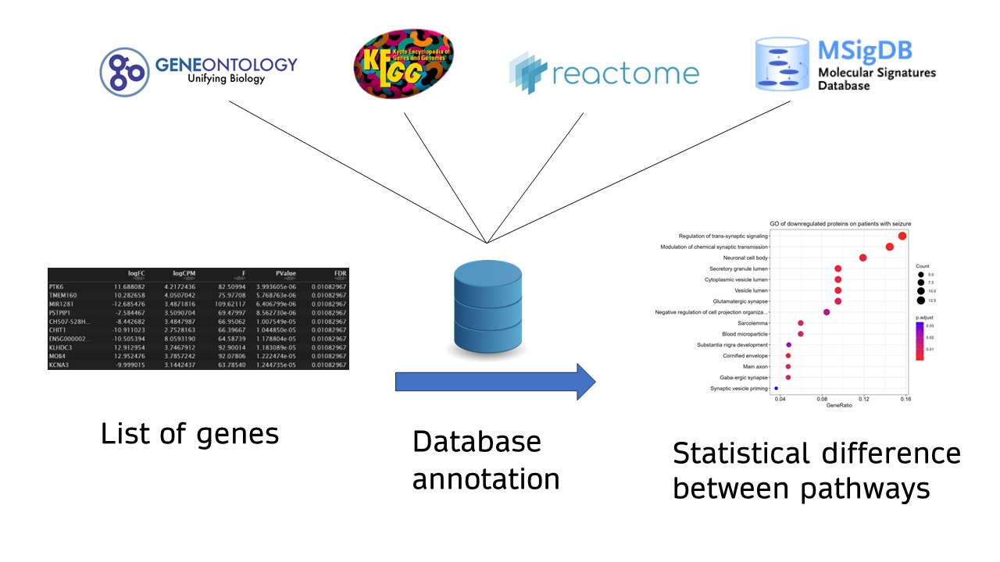
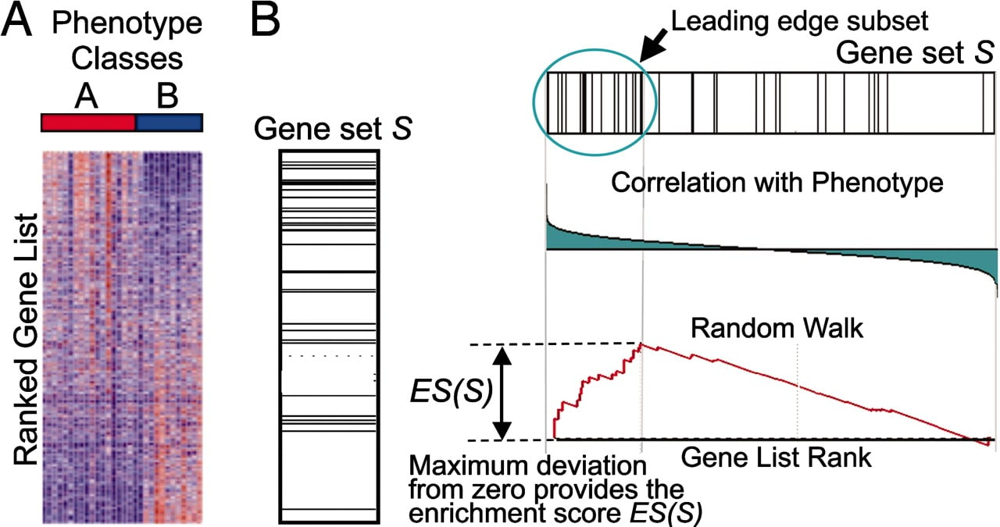

# Pathway analysis

## Principle

**Pathway analysis** คือการวิเคราะห์ข้อมูล High-throughput ให้มีความหมาย โดยการนำข้อมูลของ DNA/RNA ทั้งหมดที่ได้มาทำจัดกลุ่มร่วมกับฐานข้อมูลของยีนนั้นๆ ว่าเกี่ยวข้องกับกลไกการทำงานในระดับโมเลกุล (Molecular pathway) แบบใด

```{r pathway, fig.align="center", echo = FALSE, out.width="80%"}

```

### Database annotation

คือ การจัดกลุ่มของยีนให้ตรงกับกลุ่มของข้อมูล โดยปัจจุบันมีฐานข้อมูลดังนี้

-   [Gene ontology](https://geneontology.org/) [@thomas2022] คือ ฐานข้อมูลที่รวบรวมหน้าที่ของยีนแต่ละยีนและจัดเป็นหมวดหมู่ โดยแต่ละยีนสามารถอยู่หลายหมวดหมู่ได้ ซึ่งหมวดหมู่หลักโดยหลักนั้นแบ่งเป็น

    -   **Cellular component (CC)** คือ ยีนนั้นมักอยู่ในเซลล์ หรือสภาวะแวดล้อมรอบข้างแบบใด

    -   **Molecular function (MF)** คือ ยีนนั้นทำหน้าที่ใดบ้างในระดับโมเลกุล มักต่อท้ายด้วยคำว่า "activity"

    -   **Biological process (BP)** คือ ยีนนั้นเป็นส่วนประกอบหลักของการทำงานในระบบชีววิทยาอย่างไร ซึ่งเป็นภาพใหญ่ของหลายโมเลกุลที่มารวมตัวกันทำหน้าที่เป็นระบบ

-   [KEGG](https://www.genome.jp/kegg/) (Kyoto Encyclopedia of Genes and Genomes) [@kanehisa2016] คือ ฐานข้อมูลของข้อมูล High-throughput ที่เชื่อมโยงข้อมูลของยีนเข้ากับระบบทางอื่นๆ ทางชีววิทยา โดยหมวดหมู่นั้นแบ่งเป็น

    -   **System information** คือ ข้อมูลของความเชื่อมโยงจากข้อมูลในระบบชนิดอื่นๆ

    -   **Genomic information** คือ ข้อมูลของยีนแล้วโปรตีนจากสิ่งมีชีวิตหลากชนิด

    -   **Chemical information** คือ ข้อมูลของทางเคมี เช่น เอนไซม์ ปฏิกริยาทางชีวเคมี เป็นต้น

    -   **Health information** คือ ข้อมูลของโรคและยาต่างๆ

-   [Reactome](https://reactome.org/) [@gillespie2022] คือ ฐานข้อมูลที่รวบรวมหน้าที่การทำงานของยีนแต่ละโมเลกุล (Biological pathway) จากฐานข้อมูลและงานวิจัยต่างๆ ซึ่งมีการปรับแต่งให้เข้ากับการทำงานระดับโปรตีนด้วย

-   [MSigDB](https://www.gsea-msigdb.org/gsea/msigdb) [@liberzon2011] คือ ฐานข้อมูลที่รวบรวมจากฐานข้อมูลขั้นต้นทั้งหมดและนำมาจัดหมวดหมู่ใหม่ โดยทำการกำจัดข้อมูลที่ซ้ำกันออก

### Statistical analysis

หลังจาก Annotation แล้วผู้วิจัยมักจะทำการเปรียบเทียบว่าจากกลุ่มยีนทั้งหมด มียีนไหนที่แสดงออกมากกว่ากลุ่มอื่นอย่างมีนัยสำคัญ โดยการทดสอบนั้นมีหลายแบบ

#### Over-representation analysis (ORA)

คือ การเปรียบเทียบจำนวนยีนที่อยู่ใน Pathway นั้นๆ กับกลุ่มยีนทั้งหมดที่มีอยู่ เรียกว่ายีนพื้นหลัง (Background) โดยยีนพื้นหลังนี้หมายถึงยีนทีมีอยู่ในกลุ่มประชากรโดยทั่วไป ซึ่งการคำนวณทางสถิตินั้นใช้วิธี [Fisher's exact test](#fisher)

ยกตัวอย่างเช่น

-   ในฐานข้อมูลที่ท่านเลือกมา Annotate นั้น มี Pathway $A$ อยู่ที่ท่านสนใจ

-   ข้อมูลของของตัวท่านเองพบว่า มี DGE ทั้งหมด 5,000 ยีน และมี 500 ยีน ที่อยู่ใน Pathway $A$ (500/5,000 = 10%)

-   ส่วนข้อมูลยีนพื้นหลังของท่านนั้นมีทั้งหมด 50,000 ยีน และมี 2,000 ยีน ที่อยู่ใน Pathway $A$ และไม่ได้อยู่ใน DGE ของท่าน (2,000/50,000 = 4%)

เมื่อสร้างเป็นตาราง $2 \times 2$

```{r ora_df, echo = FALSE}
ora_df <- data.frame("DGE" = c(500, 4500), "Ref" = c(2000, 48000))
rownames(ora_df) <- c("A", "Not A")
ora_df
```

```{r ora_fisher}
fisher.test(ora_df, alternative = "greater")
```

หมายความว่า ยีนกลุ่มนี้มีการแสดงออกมากกว่าพื้นหลังอย่างมีนัยสำคัญ

**Note:**

-   ควรใช้ DGE ที่มีนัยสำคัญเท่านั้น (ทั้ง `logFC` และ $p$) เนื่องจากท่านต้องการยีนที่แสดงออกมากกว่าพื้นหลัง (ซึ่งในกรณีของ GSEA ควรใช้ยีนทั้งหมด)

-   ในการหา กลุ่มที่แสดงออกอย่างมีนัยสำคัญ จากข้อมูลยีนที่วิเคราะห์มาจาก DGE ของโปรตีนอีกครั้งหนึ่ง มักจะพบว่าหนึ่งโปรตีนมักเกิดจากหลายยีนได้ โดย ORA จะนับรวมเพิ่มเข้าไปทำให้ในกลุ่มนั้นเกิดผลบวกลวงได้เนื่องจากนับยีนที่ซ้ำกัน

#### Gene set enrichment analysis (GSEA)

```{r GSEA_pic, echo = FALSE, fig.align="center", out.width="70%"}

```

*รูปภาพจาก:* @subramanian2005

คือ การหายีนที่มีการแสดงออกมากกว่ากลุ่มอื่น ซึ่งใช้วิธีที่แตกต่างจาก ORA โดยวิธีของ GSEA ([@subramanian2005]) คือ

1.  เรียงยีนทั้งหมดที่มีอยู่ตามความแตกต่างระหว่างกลุ่ม จากมากไปน้อย (Ranked gene) ซึ่งมักจะใช้ $-log_{10}(p) \times sign(FC)$ หรือ $-log_{10}p \times log_{x}(FC)$ ($x$ เป็นอะไรก็ได้ไม่แตกต่างกัน)
2.  ให้คะแนนของยีนเรียงตามข้อ 1. แบบบวกเพิ่มไปเรื่อยๆ (Cumulative) ถ้ามียีนไหนที่อยู่ในกลุ่มที่ต้องการ (กลุ่ม $S$ ดังรูป) จะให้คะแนนเป็น + แต่ถ้ายีนไม่อยู่ในกลุ่ม จะให้คะแนนเป็น - โดยขนาดของคะแนนนั้นจะขึ้นอยู่กับความแตกต่างด้วย
3.  คำนวณ Enrichment score (ES) จากระยะทางของคะแนนที่มากที่สุด (รูปขวาล่าง) และเปรียบเทียบทางสถิติว่ามีการเปลี่ยนแปลงของคะแนนเป็นแบบ [Normal distribution](#norm-dist) หรือไม่ โดยใช้วิธี Kolmogorov-Smirnov (หลักการคล้าย [Chi-square goodness of fit](#chisq-f) สำหรับ Continuous data) ซึ่งถ้าไม่เป็น [Normal distribution](#norm-dist) แสดงว่าการแสดงออกของยีนกลุ่มนี้มีทิศทางอย่างชัดเจน ไม่ใช่แบบสุ่ม (Random walk)
4.  คำนวณ $p$-value โดยการใช้ Permutation test ซึ่งคือการสุ่มสลับ Phenotype หลายๆ ครั้งและคำนวณ จำนวนครั้งที่ ES นั้นให้ผลไม่แตกต่างจาก [Normal distribution](#norm-dist) (เช่น ไม่แตกต่าง 5/1000 ครั้ง $p$-value = 0.005)

**Note:**

-   ควรใช้ DGE **ทั้งหมด** เนื่องจากข้อมูลทั้งหมดจะถูกนำมาให้คำนวณ ES ดูจากข้อ 1.

-   ใน GSEA นั้น ถ้าพบยีนซ้ำจะทำการเฉลี่ยข้อมูล ซึ่งทำให้โอกาสเกิด False positive จาก DGE ระดับโปรตีนน้อยลง

------------------------------------------------------------------------

## Example

ในตัวอย่างนี้ จะนำ DGE จาก [Bladder cancer](#edgeR-ex) มาทำการวิเคราะห์ Pathway analysis

```{r clusterprofiler, message = FALSE, warning = FALSE}
library(clusterProfiler)
library(org.Hs.eg.db) # Homo Sapiens database
```

```{r edgeR_dge}
gene_result <- topTags(genediff, n = Inf) |> as.data.frame()
gene_result
```

### ORA

```{r ora}
gene_sig <- gene_result |> filter(FDR <= 0.05) # significant gene with FDR <= 0.01

ora_df <- bitr(rownames(gene_sig), fromType = "ALIAS", toType = "ENTREZID", 
     OrgDb = org.Hs.eg.db) |> distinct(ALIAS, .keep_all = TRUE)

ora_entries <- ora_df$ENTREZID

head(ora_entries, 20)
unique(ora_entries) |> length()
```

```{r enrichGO}
ora_cc <- enrichGO(ora_entries, org.Hs.eg.db, ont = "CC")
as.data.frame(ora_cc)
```

-   `GeneRatio` คือ อัตราส่วนยีนที่พบใน GO ต่อ ยีนทั้งหมด (มีบางส่วนถูกตัดเนื่องจากไม่มีข้อมูลในฐาน)

-   `BgRatio` คือ อัตราส่วนยีนพื้นหลังที่พบใน GO ต่อ ยีนทั้งหมด

-   `pvalue, p.adjust` คือ $p$-value จาก [FIsher's exact test](#fisher)

-   `qvalue` คือ Adjusted $p$-value จาก Package `qvalue` ซึ่งใช้วิธีที่แตกต่างกัน

ท่านสามารถสร้างกราฟจากผลนี้ได้โดย `dotplot()`, `barplot()`

```{r enrichplot, warning = FALSE, fig.path="figure/"}
dotplot(ora_cc, showCategory = 20)
barplot(ora_cc, showCategory = 10, color = "qvalue")
```

หรือ สามารถพล็อต GO pathway โดยรวมได้

```{r goplot, warning = FALSE, fig.path="figure/"}
goplot(ora_cc)
```

นอกจากนี้ยังมีฐานข้อมูลอื่นให้วิเคราะห์ได้ เช่น `enrichKEGG()`, `enrichPathway()`

### GSEA

ในส่วน GSEA จะใช้ยีน**ทั้งหมด**เรียงจากมากไปน้อย

```{r GSEA}
gene_result_ranked <- gene_result |> 
  mutate(Score = -log10(FDR)*logFC) |>
  rownames_to_column("ALIAS") |> 
  arrange(desc(Score)) # arrange score max -> min
gene_result_ranked |> dplyr::select(ALIAS, logFC, FDR, Score)
```

ต่อจากนั้นจะนำข้อมูลนี้ไปใช้ต่อ ซึ่งต้องเปลี่ยนเป็น Entries ID เหมือน ORA

```{r rank_dge}
gene_df <- bitr(gene_result_ranked$ALIAS, "ALIAS", "ENTREZID", org.Hs.eg.db) |> 
  distinct(ALIAS, .keep_all = TRUE)

dge_ranked <- gene_result_ranked |> left_join(gene_df, by = "ALIAS") |> 
  pull( Score, ENTREZID) 
```

```{r gsea, warning = FALSE}
gsea_bp <- gseGO(na.omit(dge_ranked), 
                 ont = "MF", 
                 OrgDb = org.Hs.eg.db, 
                 keyType = "ENTREZID")

as.data.frame(gsea_bp)
```

จะเห็นว่าผลลัพธ์ที่ได้เป็น ES แทน Ratio

ท่านสามารถแสดงผลลัพธ์ได้เหมือน ORA

```{r gsea_dotplot, fig.path="figure/"}
dotplot(gsea_bp, showCategory = 20, font.size = 10, label_format = 50)
```

สำหรับ GSEA ท่านสามารถพล็อตการคำนวณคะแนนในแต่ละยีนได้ด้วย `gseaplot()`

```{r gseaplot, fig.path="figure/"}
gseaplot(gsea_bp, geneSetID = 1, title = gsea_bp$ID[1], font.size = 5)
```

โดยตำแหน่งขีดสีดำคล้ายบาร์โค้ด คือตำแหน่งของยีนที่อยู่ใน Pathway กลุ่มนั้น โดยความยาวของขีดคือ Signal-to-noise ratio
